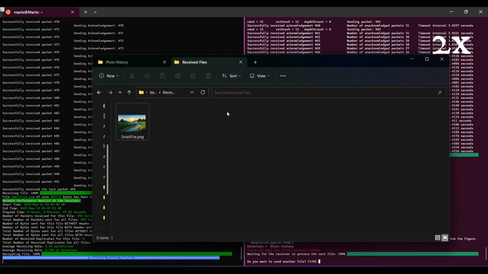
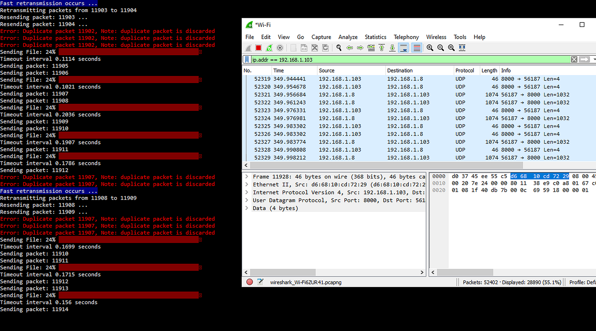
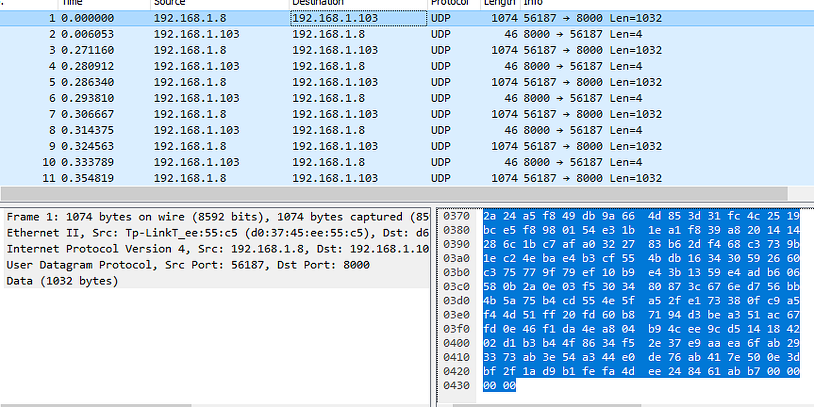
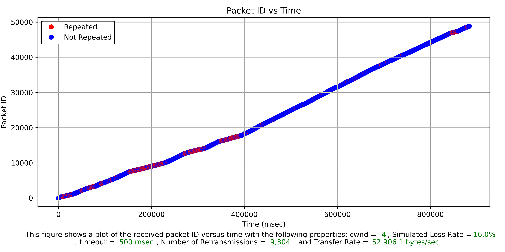
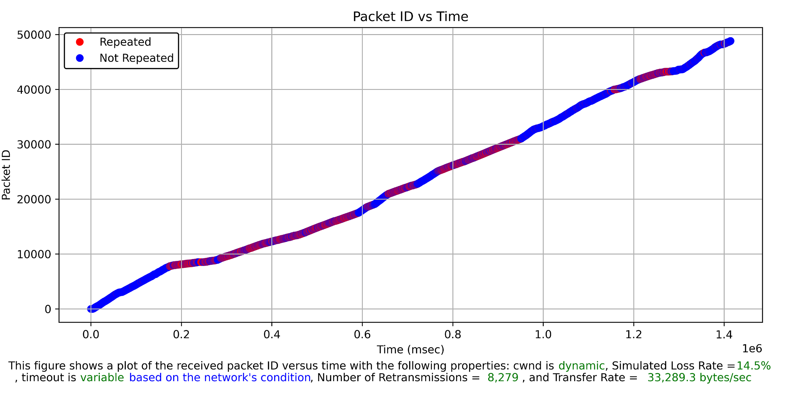
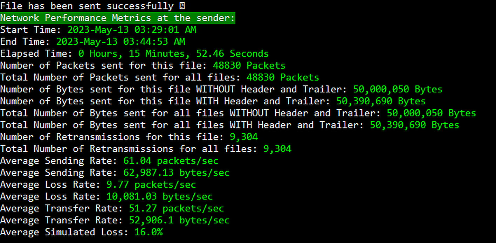
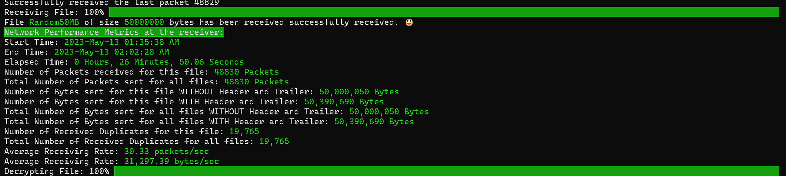

# Reliable UDP File Transfer

A networking project that implements reliable file transfer over UDP using Go-Back-N ARQ, cumulative acknowledgements, Reno congestion-window control, adaptive retransmission timeouts. It also includes packet-capture analysis, and performance reporting.

## Demo

[Watch the project demonstration on YouTube](https://youtu.be/lB6PRiQerOo)

The demonstration is a screen recording showing file transmission between the sender and receiver, transfer progress, and performance metrics.



## Main Features

* Reliable file delivery over UDP.
* Go-Back-N sliding-window retransmission.
* Cumulative acknowledgements.
* Duplicate-ACK detection.
* Fast retransmission after three duplicate acknowledgements.
* Reno congestion-window adjustment.
* Slow start and congestion avoidance.
* Multiplicative reduction after packet loss or timeout.
* Adaptive timeout estimation using measured round-trip time.
* Sender and receiver performance statistics.
* Multiple sequential file transfers.

## Protocol Overview

The sender divides a file into chunks with a maximum payload size of 1024 bytes. Each UDP datagram contains a packet identifier, a file identifier, a payload, and a trailer value.

| Field     |             Size |
| --------- | ---------------: |
| Packet ID |          2 bytes |
| File ID   |          2 bytes |
| Payload   | Up to 1024 bytes |
| Trailer   |          4 bytes |

The trailer is set to `0xFFFF` for the final packet and `0x0000` for the remaining packets.

File metadata is transferred before the file contents. The metadata includes:

* File name
* File size
* SHA-256 hash of the shared key file

The receiver, then, verifies the metadata before accepting the complete file.

## Reliable Data Transfer

The receiver accepts packets in order and sends cumulative acknowledgements. Out-of-order packets are discarded, and the acknowledgement for the last accepted packet is repeated.

The sender maintains:

* The first unacknowledged packet
* The last packet placed on the network
* The number of unacknowledged packets
* A congestion window
* A slow-start threshold
* Duplicate-ACK count
* Per-packet timing information

After three duplicate acknowledgements, the sender performs a fast retransmission beginning at the first unacknowledged packet.



## Reno-Style Congestion Control

The congestion window begins at one packet.

During slow start, the window grows rapidly until it reaches the slow-start threshold. After that point, it increases gradually during congestion avoidance.

When a timeout occurs:

1. The slow-start threshold is reduced.
2. The congestion window returns to one packet.
3. The outstanding Go-Back-N window is retransmitted.

After three duplicate acknowledgements, the implementation performs fast retransmission and reduces the congestion window.

## Adaptive Timeout Estimation

The retransmission timeout is updated from measured round-trip times.

```text
EstimatedRTT =
        (1 - alpha) * EstimatedRTT + alpha * SampleRTT

DevRTT =
        (1 - beta) * DevRTT + beta * abs(SampleRTT - EstimatedRTT)

TimeoutInterval =
        EstimatedRTT + 4 * DevRTT
```

The values of alpha and beta used in the implementation are:

```text
alpha = 0.125
beta  = 0.25
```

This allows the retransmission timeout to adapt to changing network conditions instead of remaining fixed.

## Packet Inspection

Wireshark was used to verify:

* UDP data packets
* Cumulative acknowledgement packets
* Source and destination endpoints
* Packet sizes
* Initial and final packets
* Payload transformation
* Retransmission behavior



## Payload Transformation and Validation

Before transmission, the sender applies a reversible transformation to each payload chunk as a simple encryption technique to prevent packet sniffing:

1. Swap adjacent bytes.
2. Combine the first half of each chunk with the second half of the corresponding chunk counted from the end of the file.
3. Apply XOR using a time-derived key.

The receiver then performs the inverse operations to reconstruct the original payload. The sender also transmits the SHA-256 hash of a shared key file, which the receiver compares to its local hash before accepting the file. If the received hash doesn't match the local one, then the file is not accepted.

This method is just a simple encryption implementation, standard cryptographic protocols such as TLS are recommended for practical use.

## Performance Visualization

The sender records acknowledgement timing and packet identifiers. Repeated packet identifiers are plotted in red, while packets acknowledged without retransmission are plotted in blue.



The following run used a dynamic congestion window and an RTT-based timeout under a test condition that produced substantial retransmission:



## Example 50 MB Test

One recorded 50 MB test produced the following sender statistics:

| Metric                        |             Result |
| ----------------------------- | -----------------: |
| File size                     |   50,000,000 bytes |
| Packets                       |             48,830 |
| Sender elapsed time           |   15 min 52.46 sec |
| Retransmissions               |              9,304 |
| Transfer rate                 | 52,906.1 bytes/sec |
| Reported retransmission ratio |              16.0% |



The receiver recorded the completed file and reported its corresponding statistics.



## Requirements

* Python 3
* Matplotlib
* tqdm
* playsound
* Wireshark for packet inspection

Install the Python dependencies with:

```bash
pip install matplotlib tqdm playsound==1.2.2
```

## Running the Project

Create the same `Key File.txt` in the sender and receiver directories before starting the transfer.

Start the receiver:

```bash
cd Receiver
python receiver.py 0.0.0.0 8000
```

Start the sender from another terminal or LAN endpoint:

```bash
cd Sender
python sender.py SmallFile.png RECEIVER_IP 8000
```

Replace `RECEIVER_IP` with the receiver's address.

After a successful transfer, the sender can be used to select and transmit another file.

## Limitations

* Custom payload transformation is not cryptographically secure.
* Shared time-derived key behavior requires coordinated endpoints.
* Receiver can accept files of size 64 MB or less.
* Terminal output for each packet reduces performance.
* Go-Back-N retransmits multiple packets when a single packet is lost.

## Possible Improvements

* Replace the custom transformation with authenticated encryption.
* Add a connection establishment handshake.
* Add selective repeat to send only the lost packets.
* Add checksum validation per packet.
* Support resumable transfers.
